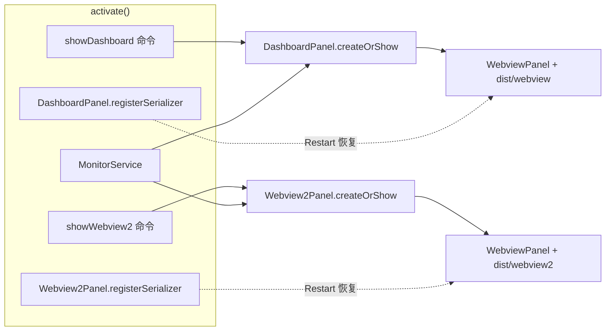
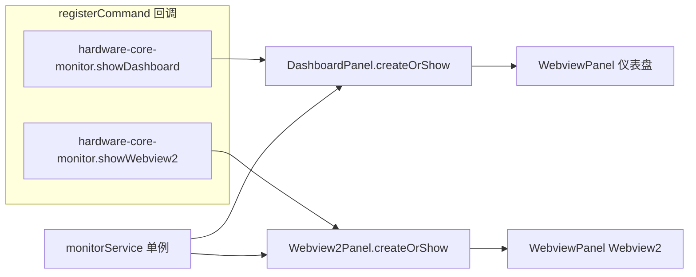
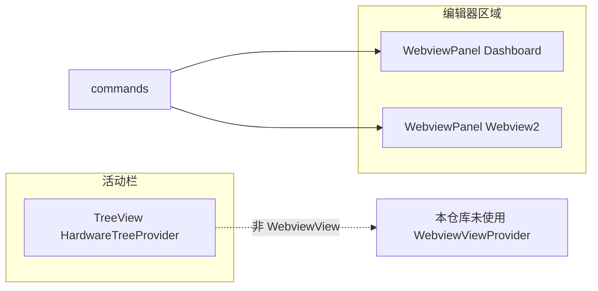

# 双 Webview 页面注册与打开机制

本文说明本仓库如何注册并打开 **两个独立的 Webview 页面**。前端为 **React + Vite**（`webview/` 与 `webview2/` 两个子包），不是 Vue。

消息通信、快照协议与安全策略见 [Webview消息协议.md](./Webview消息协议.md)。命令声明见 [VSCode插件通信/01-命令.md](./VSCode插件通信/01-命令.md)。

文档中含 **三处 Mermaid 图**（§1.1、§3.2、§6）；与采集、分发相关的总览见 [数据采集与分发.md](./数据采集与分发.md)。

## 1. 整体结构

两个 Webview 在扩展宿主侧各有一个 `WebviewPanel` 封装类，**共用同一个 `MonitorService`** 做数据采集与推送，但 **viewType、静态资源目录、开发服务器端口** 完全隔离，可同时打开两个窗口。

| 页面                     | 宿主类           | `viewType`                        | 前端工程    | 构建产物        | 开发 Dev Server                        |
| ------------------------ | ---------------- | --------------------------------- | ----------- | --------------- | -------------------------------------- |
| 仪表盘 Dashboard         | `DashboardPanel` | `hardware-core-monitor.dashboard` | `webview/`  | `dist/webview`  | `WEBVIEW_DEV_SERVER_URL`（默认 5173）  |
| Webview2（带 Hash 路由） | `Webview2Panel`  | `hardware-core-monitor.webview2`  | `webview2/` | `dist/webview2` | `WEBVIEW2_DEV_SERVER_URL`（默认 5174） |

### 1.1 注册与打开总览（Mermaid）

`activate()` 内完成序列化注册与命令绑定；用户触发命令后各自 `createOrShow`，最终挂载独立产物并共享 `MonitorService`。



## 2. 在 `package.json` 中声明命令

两个页面 **没有** 通过 `contributes.views` 注册为侧边栏 `WebviewViewProvider`，而是通过 **Command** 在编辑器区域打开 `WebviewPanel`：

| 命令 ID                               | 作用                             |
| ------------------------------------- | -------------------------------- |
| `hardware-core-monitor.showDashboard` | 打开第一个 Webview（仪表盘）     |
| `hardware-core-monitor.showWebview2`  | 打开第二个 Webview（多路由页面） |

定义位置：`package.json` → `contributes.commands`。

**额外入口**：状态栏点击会执行 `showDashboard`（`src/statusBarController.ts` 中 `this.item.command = "hardware-core-monitor.showDashboard"`）。

## 3. 在 `extension.ts` 的 `activate` 中注册

入口文件：`src/extension.ts`。

### 3.1 面板序列化（Restart 后恢复）

调试时执行 **Restart Extension** 会重启 Extension Host，已打开的 Webview 面板需要 **WebviewPanelSerializer** 才能恢复并重新注入 HTML：

```ts
DashboardPanel.registerSerializer(context, monitorService);
Webview2Panel.registerSerializer(context, monitorService);
```

实现见：

- `DashboardPanel.registerSerializer` → `src/dashboardPanel.ts`
- `Webview2Panel.registerSerializer` → `src/webview2Panel.ts`

内部调用 `vscode.window.registerWebviewPanelSerializer(viewType, { deserializeWebviewPanel })`，在 `deserialize` 中调用各类的 `revive()`，清空旧 HTML 后重新挂载并订阅 `MonitorService`。

### 3.2 命令与 Panel 绑定

```ts
vscode.commands.registerCommand("hardware-core-monitor.showDashboard", () => {
  DashboardPanel.createOrShow(context, monitorService);
});

vscode.commands.registerCommand("hardware-core-monitor.showWebview2", () => {
  Webview2Panel.createOrShow(context, monitorService);
});
```

上述 disposable 与 `monitorService` 等一并放入 `context.subscriptions`，扩展卸载时统一释放。



## 4. Panel 类如何创建 Webview

`DashboardPanel` 与 `Webview2Panel` 模式一致，差异主要在 viewType、标题、`localResourceRoots` 与开发环境变量。

### 4.1 创建或复用面板

`createOrShow` 逻辑：

1. 若已有 `currentPanel`，则 `panel.reveal(column)` 聚焦，不重复创建。
2. 否则 `vscode.window.createWebviewPanel(viewType, title, column, options)`。
3. 选项中包含 `retainContextWhenHidden: true`，隐藏面板时保留 React 状态（Webview2 还保留 Hash 路由位置）。

### 4.2 资源隔离

`webviewOptions` 中设置：

- `enableScripts: true` — 运行 React 与 `postMessage`。
- `localResourceRoots` — **只允许** 访问对应产物目录，防止两个 Webview 互相读错资源：
  - Dashboard：`dist/webview`
  - Webview2：`dist/webview2`

### 4.3 注入 HTML

构造函数中：`panel.webview.html = this.getHtml(panel.webview)`。

`getHtml` 行为：

- **生产**：加载 `dist/.../assets/index.js` 与 `index.css`，URL 带文件修改时间 query（避免 Restart 后 Webview 缓存旧 JS）。
- **开发**：读取 `WEBVIEW_DEV_SERVER_URL` / `WEBVIEW2_DEV_SERVER_URL`，注入 Vite Dev Server 地址并放宽 CSP（见 `.vscode/launch.json` 与 `docs/Webview消息协议.md`）。

### 4.4 与 MonitorService 的衔接

两个 Panel 在构造时都会：

1. `panel.webview.onDidReceiveMessage` — 处理 Webview 发来的 `ready` / `refresh` 等（Dashboard 还支持复制/导出报告等）。
2. `monitorService.onDidChangeSnapshot` — 向 Webview `postMessage` 推送 `snapshot`。
3. `monitorService.onDidError` — 推送 `error` 消息。

协议类型定义在 `src/shared/protocol.ts`，前后端共用。

打开流程的时序（`ready`、快照补发、`postMessage`）见 [Webview消息协议.md](./Webview消息协议.md) 与 [数据采集与分发.md](./数据采集与分发.md)。

## 5. 前端侧：两个独立 Vite 子包

| 目录        | 入口                    | 特点                                                                                        |
| ----------- | ----------------------- | ------------------------------------------------------------------------------------------- |
| `webview/`  | `webview/src/main.tsx`  | 单页仪表盘                                                                                  |
| `webview2/` | `webview2/src/main.tsx` | 使用 `HashRouter`（Webview 源为 `vscode-webview://`，无服务端路由，不能用 `BrowserRouter`） |

根目录 `package.json` 脚本：

- `build:webview` / `watch:webview` — 构建 `hardware-core-monitor-webview`
- `build:webview2` / `watch:webview2` — 构建 `hardware-core-monitor-webview2`
- `compile` / `package` — 扩展打包前会同时构建两个 Webview 产物到 `dist/webview` 与 `dist/webview2`

Vite 输出目录配置：

- `webview/vite.config.ts` → `outDir: "../dist/webview"`
- `webview2/vite.config.ts` → `outDir: "../dist/webview2"`

## 6. 与 TreeView / WebviewView 的区别

本项目的 Webview 是 **编辑器区域的 WebviewPanel**（命令打开），不是活动栏里的 **WebviewViewProvider**。侧边栏树由 `HardwareTreeProvider` + `createTreeView` 提供，见 [VSCode插件通信/03-UI与Provider.md](./VSCode插件通信/03-UI与Provider.md)。



## 7. 小结：「注册两个 Webview」在本项目中的四步

1. **`package.json`** — 贡献两个 command ID。
2. **`activate`** — 为两个 `viewType` 分别注册 **`registerWebviewPanelSerializer`**。
3. **`activate`** — 用 **`registerCommand`** 分别调用 `DashboardPanel.createOrShow` / `Webview2Panel.createOrShow`。
4. **Panel 类** — **`createWebviewPanel` + 独立 `localResourceRoots` + HTML 注入** 挂载对应 React 产物，经 **`MonitorService` + `protocol.ts`** 与前端通信。

## 8. 相关源码索引

| 文件                         | 职责                                        |
| ---------------------------- | ------------------------------------------- |
| `src/extension.ts`           | 序列化注册、命令注册、装配 `MonitorService` |
| `src/dashboardPanel.ts`      | 第一个 WebviewPanel                         |
| `src/webview2Panel.ts`       | 第二个 WebviewPanel                         |
| `src/monitorService.ts`      | 唯一数据源，面板订阅快照事件                |
| `src/shared/protocol.ts`     | 宿主 ↔ Webview 消息类型                     |
| `src/statusBarController.ts` | 状态栏 → `showDashboard`                    |
