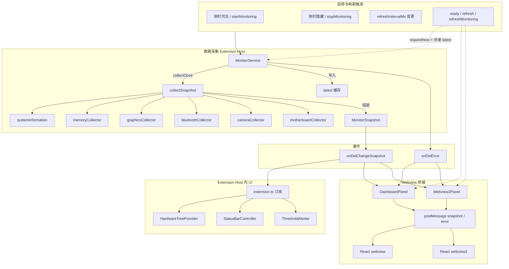
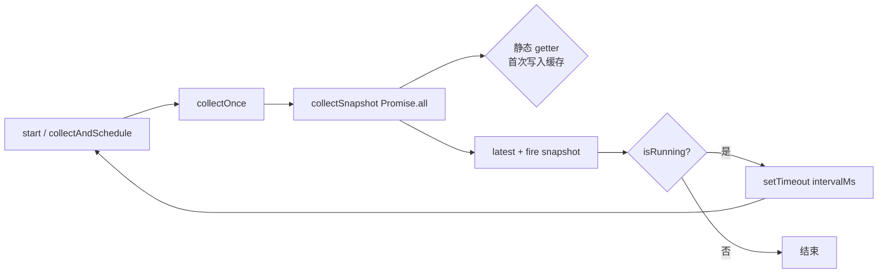
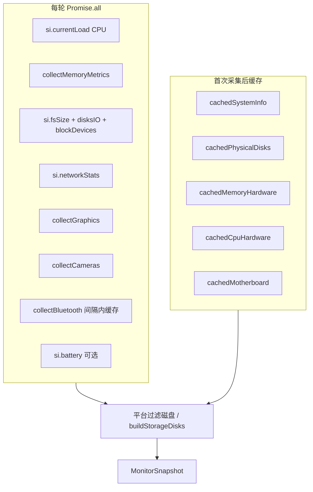
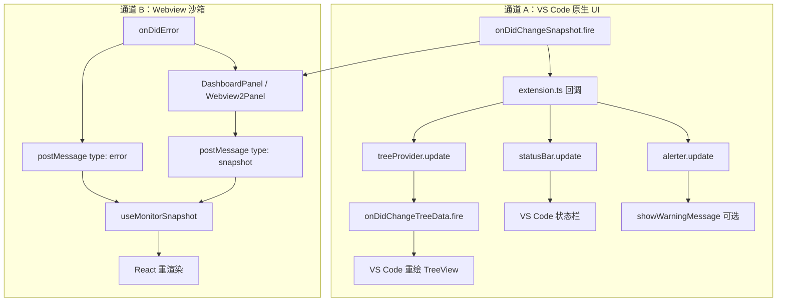
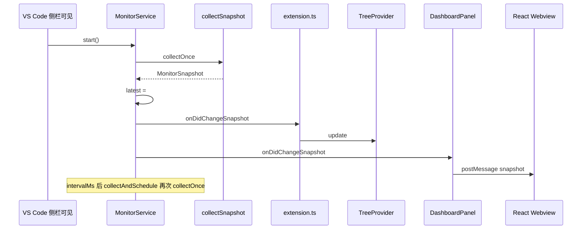
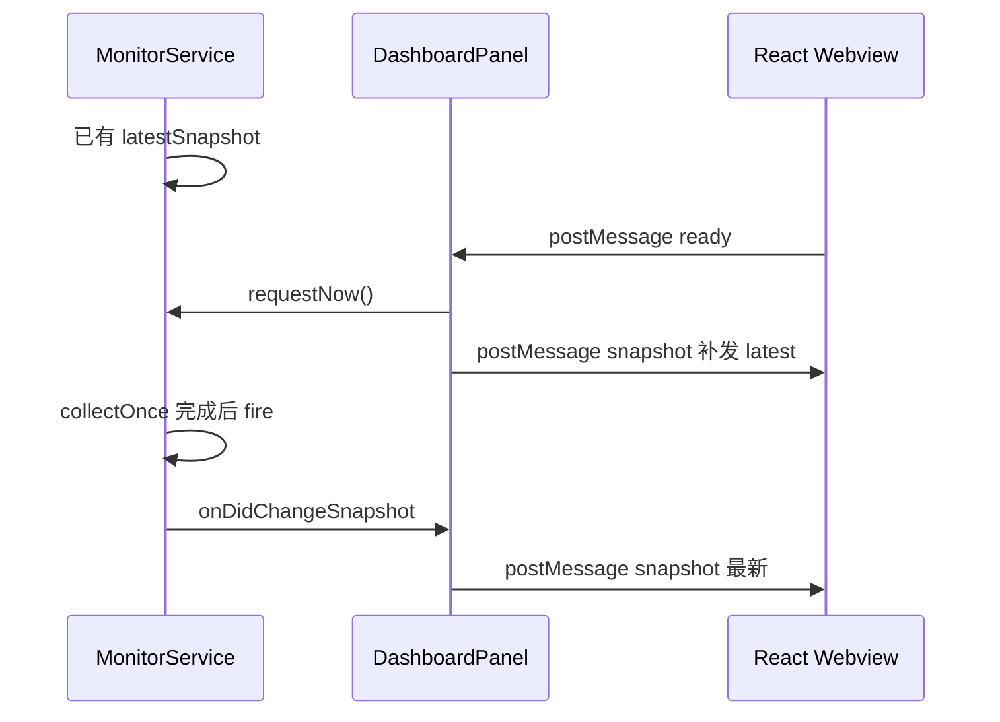

# 硬件数据采集与分发

本文说明本插件 **如何采集系统数据**、**如何变成 `MonitorSnapshot`**，以及 **同一份快照如何送到 TreeView、状态栏、告警与 Webview**。下文用 **Mermaid 图** 概括架构与时序，并保留关键代码引用；细节见文末链接。

双 Webview 的 **命令注册、Serializer、`createWebviewPanel`** 见 [双Webview注册.md](./双Webview注册.md)。

## 设计原则

- **单一数据源**：只有 `MonitorService`（及它调用的 collector）访问 `systeminformation` 和系统命令；UI 只消费事件，不重复轮询。
- **可序列化边界**：对外统一使用 `src/shared/protocol.ts` 里的 `MonitorSnapshot`；Webview 只收 JSON，不接触 Node 原始对象。
- **静态与动态分离**：系统信息、盘布局、内存模组、CPU/主板静态字段等 **采一次缓存**；CPU 负载、内存用量、网络速率等 **每轮更新**。

## 架构总览（Mermaid）



装配入口（唯一 `MonitorService`，非 Webview 消费者在 `extension.ts` 订阅）：

```20:45:src/extension.ts
export function activate(context: vscode.ExtensionContext): void {
  // 唯一的数据源：所有 UI 都订阅它
  const monitorService = new MonitorService(getRefreshIntervalMs());
  // ...
  monitorService.onDidChangeSnapshot(
    (snapshot) => {
      treeProvider.update(snapshot);
      statusBar.update(snapshot);
      alerter.update(snapshot);
    },
    undefined,
    context.subscriptions,
  );
```

## 采集流程（Mermaid）

调度：`start()` 后 **递归 `setTimeout`**（非 `setInterval`），上一轮 `collectOnce` 结束再安排下一轮；`isCollecting` 防并发；`start()` 时预热 `si.disksIO()` 以便下一轮有磁盘速率。



`collectSnapshot` 内 **并行** 拉动态指标；静态块通过 getter **懒加载并缓存** 在 `MonitorService` 上：



### 每轮更新（动态）

| 数据           | 来源                                                                                |
| -------------- | ----------------------------------------------------------------------------------- |
| CPU 使用率     | `si.currentLoad()`                                                                  |
| 内存运行时     | `collectMemoryMetrics()`（macOS 对齐活动监视器，见 `memoryCollector.ts`）           |
| 磁盘容量 / I/O | `si.fsSize()`、`si.disksIO()`、`si.blockDevices()` + 平台过滤与 `buildStorageDisks` |
| 网络           | `si.networkStats()`                                                                 |
| GPU / 显示器   | `collectGraphics()` → `si.graphics()`                                               |
| 摄像头         | `collectCameras()`（按平台）                                                        |
| 蓝牙           | `collectBluetooth()`（macOS 用 `system_profiler`，且 **按刷新间隔缓存**）           |
| 电池           | `si.battery()`（失败为 `null`，不中断整轮）                                         |

### 首次采集后缓存（静态 / 半静态）

- `cachedSystemInfo` — `si.osInfo()` + `si.cpu()`
- `cachedPhysicalDisks` — `si.diskLayout()`
- `cachedMemoryHardware` — `si.memLayout()`
- `cachedCpuHardware` — CPU 型号、核心数、基频等
- `cachedMotherboard` — `collectMotherboard()`

快照结构见 `MonitorSnapshot`（`src/shared/protocol.ts`）。

### 专用 Collector

| 文件                      | 作用                                               |
| ------------------------- | -------------------------------------------------- |
| `memoryCollector.ts`      | `si.mem()`；macOS 额外 `vm_stat` / `sysctl` 算缓存 |
| `graphicsCollector.ts`    | 一次 `si.graphics()` 得到 GPU + 显示器             |
| `bluetoothCollector.ts`   | 间隔内返回缓存；macOS 一次 profiler                |
| `cameraCollector.ts`      | 平台脚本或 sysfs/v4l2；并发去重                    |
| `motherboardCollector.ts` | 主板静态信息                                       |

## 何时开始 / 停止采集

| 触发                                                       | 行为                                       |
| ---------------------------------------------------------- | ------------------------------------------ |
| 侧栏 TreeView **可见**                                     | `monitorService.start()`                   |
| 侧栏 **隐藏**                                              | `monitorService.stop()`                    |
| 命令 `startMonitoring` / `stopMonitoring`                  | 手动启停                                   |
| 配置 `hardwareCoreMonitor.refreshIntervalMs` 变更          | `updateInterval()` 并重启调度              |
| Webview 发 `ready` / `refresh`，或命令 `refreshMonitoring` | `requestNow()`：立即采一轮，不改变周期节奏 |

间隔由 `getRefreshIntervalMs()` 读取（默认 10s，最小 500ms），见 `src/refreshIntervalConfig.ts`。

## 调度与事件（代码）

```150:208:src/monitorService.ts
  private async collectAndSchedule(): Promise<void> {
    await this.collectOnce();

    if (!this.isRunning) {
      return;
    }

    this.timer = setTimeout(() => {
      void this.collectAndSchedule();
    }, this.intervalMs);
  }

  private async collectOnce(): Promise<void> {
    if (this.isCollecting) {
      return;
    }

    this.isCollecting = true;

    try {
      const snapshot = await collectSnapshot(/* 静态数据 getter，内部带缓存 */);
      this.latest = snapshot;
      this._onDidChangeSnapshot.fire(snapshot);
    } catch (error) {
      // ...
      this._onDidError.fire(message);
    } finally {
      this.isCollecting = false;
    }
  }
```

```62:71:src/monitorService.ts
  private readonly _onDidChangeSnapshot =
    new vscode.EventEmitter<MonitorSnapshot>();

  private readonly _onDidError = new vscode.EventEmitter<string>();

  readonly onDidChangeSnapshot = this._onDidChangeSnapshot.event;
  readonly onDidError = this._onDidError.event;
```

## 分发流程（Mermaid）

同一份 `MonitorSnapshot` 经 **两条通道** 出去：Extension Host 内直接 `update`，Webview 经面板 `postMessage`。



| 消费者            | 文件                                     | 行为                                              |
| ----------------- | ---------------------------------------- | ------------------------------------------------- |
| 侧边栏树          | `hardwareTreeProvider.ts`                | `update(snapshot)` → `onDidChangeTreeData.fire()` |
| 状态栏            | `statusBarController.ts`                 | `CPU x% \| RAM y%`                                |
| 阈值告警          | `thresholdAlerter.ts`                    | 读阈值，超限时弹窗（60s 冷却）                    |
| 仪表盘 / Webview2 | `dashboardPanel.ts` / `webview2Panel.ts` | 订阅快照与错误，转发 postMessage                  |

面板侧订阅（两个 Webview 面板逻辑相同）：

```67:72:src/dashboardPanel.ts
    this.monitorService.onDidChangeSnapshot(
      (snapshot) => void this.postSnapshot(snapshot),
      this,
      this.disposables,
    );
```

Webview 反向：`ready` / `refresh` → `requestNow()`，若已有 `latestSnapshot` 则 **先补发**，再等待下一轮 `fire`。

## 典型时序（Mermaid）

### 周期采集 + 多消费者



### Webview 晚于宿主就绪（补发）



## 相关文档

| 文档                                                      | 内容                                         |
| --------------------------------------------------------- | -------------------------------------------- |
| [06-内部事件总线.md](./VSCode插件通信/06-内部事件总线.md) | `MonitorService` 事件与 Tree/StatusBar 订阅  |
| [Webview消息协议.md](./Webview消息协议.md)                | Webview ↔ 宿主消息类型与生命周期             |
| [03-UI与Provider.md](./VSCode插件通信/03-UI与Provider.md) | TreeView / StatusBar 与 VS Code 的 pull 模型 |
| [04-配置.md](./VSCode插件通信/04-配置.md)                 | 刷新间隔与阈值配置                           |
